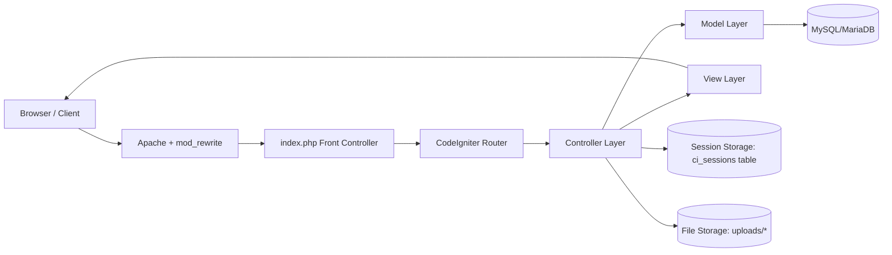
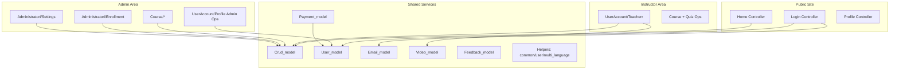
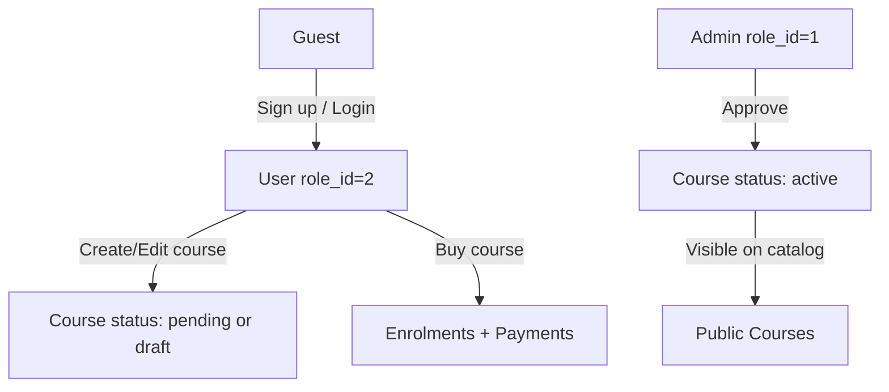
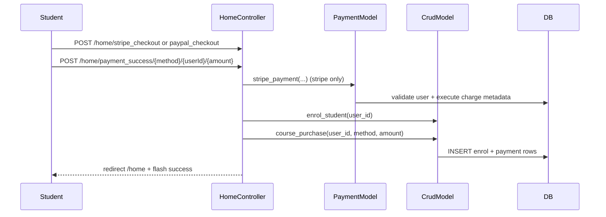
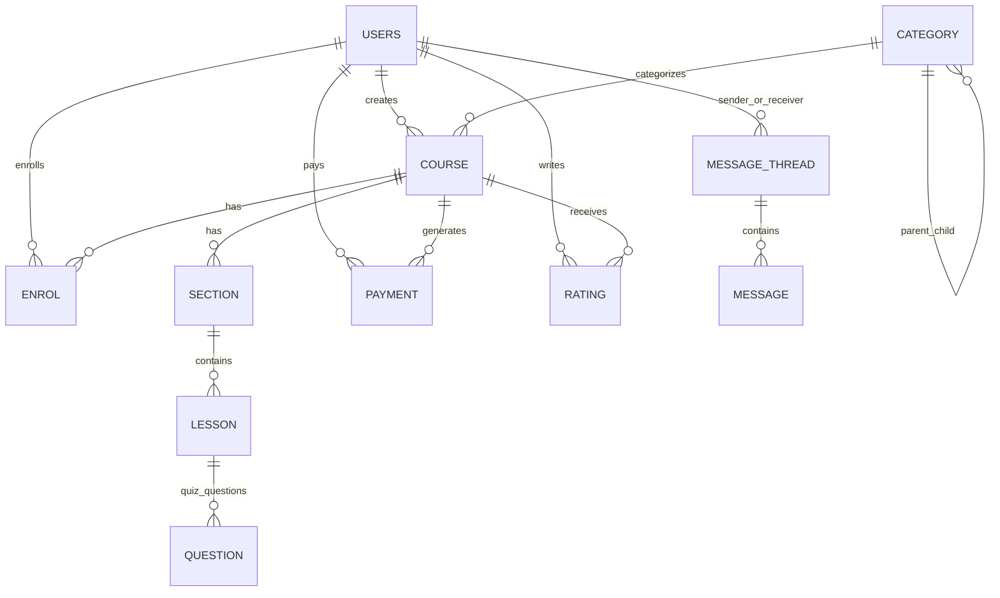

# LMS-UserAccount2

CodeIgniter 3 based Learning Management System (LMS) web application with student, instructor, and admin capabilities.

## 1) High-Level Architecture



## 2) Module Design



## 3) Request and Role Flow

### Role-based flow


### Checkout flow


## 4) Project Structure

```text
/
|- application/
|  |- config/                  # CI config (routes, db, autoload, sessions)
|  |- controllers/             # Feature-oriented controllers
|  |  |- Home.php              # Public pages, learning, cart, checkout
|  |  |- UserAccount/          # Login, profile, instructor
|  |  |- Course/               # Admin course/category/lesson/quiz ops
|  |  |- Administratori/       # Admin settings + revenue + enrollment
|  |  |- Payment/              # Cart + payment operations
|  |  |- Messages/             # Private messaging
|  |  `- Feedbacks/            # Ratings
|  |- models/                  # Domain and data logic
|  |- views/                   # Frontend + backend templates/fragments
|  |- helpers/                 # common/user/multi-language helpers
|  `- libraries/Stripe/        # Stripe SDK (embedded)
|- assets/                     # Static frontend/backend assets
|- db/dbl.sql                  # SQL schema + seed data
|- ci_sessions/                # Session path directory
|- uploads/                    # Thumbnails, lesson files, system media
|- index.php                   # CI front controller
`- .htaccess                   # Rewrite to index.php
```

## 5) API Surface (HTTP Endpoints)

This app is mostly server-rendered HTML + form/AJAX endpoints (not a pure REST API).

### Public and Learning
- `GET /` -> default route to `home`
- `GET /home/courses` (supports query filters: category, price, level, language, rating)
- `GET /home/course/{slug}/{courseId}`
- `GET /home/lesson/{slug}/{courseId}/{lessonId?}`
- `GET /home/instructor_page/{instructorId}`
- `GET /home/search?query=...`
- `GET /home/about_us`, `/home/terms_and_condition`, `/home/privacy_policy`

### Authentication and User Account
- `POST /useraccount/login/validate_login/{from?}`
- `POST /useraccount/login/register`
- `POST /useraccount/login/forgot_password/{from?}`
- `GET /useraccount/login/logout/{from?}`
- `GET /useraccount/login/verify_email_address/{verificationCode}`
- `GET|POST /home/profile/{user_profile|user_credentials|user_photo}`
- `POST /home/update_profile/{update_basics|update_credentials|update_photo}`

### Cart and Checkout
- `POST /home/handleCartItems`
- `POST /home/handleCartItemForBuyNowButton`
- `POST /home/paypal_checkout`
- `POST /home/stripe_checkout`
- `POST /home/payment_success/{method}/{userId}/{amountPaid}`

### Instructor Endpoints
- `GET /useraccount/teacherr/courses`
- `POST /useraccount/teacherr/course_actions/{add|edit|delete|draft|publish}/{courseId?}`
- `POST /useraccount/teacherr/sections/{courseId}/{add|edit|delete}/{sectionId?}`
- `POST /useraccount/teacherr/lessons/{courseId}/{add|edit|delete}/{lessonId?}`
- `POST /useraccount/teacherr/quizes/{courseId}/{add|edit|delete}/{quizId?}`
- `POST /useraccount/teacherr/quiz_questions/{quizId}/{add|edit|delete}/{questionId?}`
- `GET|POST /useraccount/teacherr/payment_settings`
- `GET|POST /useraccount/teacherr/instructor_revenue`

### Admin Endpoints
- `GET /useraccount/profile/dashboard`
- `GET|POST /useraccount/profile/users/{add|edit|delete}/{userId?}`
- `GET /course/course/courses`
- `GET /course/course/pending_courses`
- `POST /course/course/course_actions/{add|edit|delete}/{courseId?}`
- `POST /course/course/change_course_status/{updated_status}`
- `GET|POST /course/kategorite/categories/{add|edit|delete}/{categoryId?}`
- `GET|POST /administratori/enrollment/enrol_history`
- `POST /administratori/enrollment/enrol_student/enrol`
- `GET|POST /administratori/settings/system_settings`
- `GET|POST /administratori/settings/frontend_settings`
- `GET|POST /administratori/settings/payment_settings`
- `GET|POST /administratori/settings/smtp_settings`
- `GET|POST /administratori/settings/manage_language`

### Messaging and Feedback
- `GET|POST /messages/message/message/{message_home|message_read|send_new|send_reply}`
- `GET|POST /home/my_messages/{read_message|send_new|send_reply}/{threadCode?}`
- `POST /home/rate_course`
- `POST /feedbacks/rate/rate_course`

### AJAX/Fragment endpoints
- `POST /home/handleWishList` -> HTML fragment (`wishlist_items`)
- `POST /home/handleCartItems` -> HTML fragment (`cart_items`)
- `POST /home/refreshShoppingCart` -> HTML fragment
- `POST /home/my_courses_by_category` -> HTML fragment
- `POST /home/reload_my_wishlists` -> HTML fragment
- `POST /home/get_course_details` -> plain text title
- `POST /home/isLoggedIn` -> plain text `true|false`
- `POST /course/ligjerata/ajax_get_video_details` -> duration text
- `POST /course/course/ajax_get_section` -> HTML fragment
- `POST /course/kategorite/ajax_get_sub_category` -> HTML fragment

## 6) Data Model (Core Entities)



Primary tables from dump: `users`, `role`, `course`, `category`, `section`, `lesson`, `question`, `enrol`, `payment`, `rating`, `message_thread`, `message`, `settings`, `frontend_settings`, `currency`, `ci_sessions`.

## 7) Runtime Characteristics

- Routing is mostly conventional CodeIgniter URI mapping (`/controller/method/...`).
- `default_controller` is `home`.
- URL rewriting is done by `.htaccess` to `index.php`.
- `base_url` is dynamically built from request host and script path.
- Session driver is configured to `database` with save path table `ci_sessions`.
- Theme selection is read from `frontend_settings.theme` and used to resolve view folder (`frontend/default/...`).

## 8) Current Review Findings (Architecture/Code Quality)

- **Controller compile blocker:** `application/controllers/Payment/Llojipageses.php` redeclares `invoice()` and `payment_success()`, which causes a fatal parse error when loaded.
- **Legacy PHP compatibility risk:** `system/libraries/Profiler.php` contains deprecated curly-brace string offset syntax (breaks under modern PHP lint in this environment).
- **Database naming mismatch:** app config uses `dbuseraccount` while SQL dump header references `dblearning`.
- **Undefined model methods referenced:** instructor payment settings call `update_instructor_paypal_settings` and `update_instructor_stripe_settings`, but these methods are not present in scanned models.
- **Controller method mismatch:** `Course::preview()` calls `is_the_course_belongs_to_current_instructor()` but that method exists in `Teacherr`, not in `Course`.
- **Large model duplication:** `User_model` and `Crud_model` share significant overlapping behavior, making maintenance and testing harder.
- **Security posture is legacy:** SHA1 password hashing, CSRF disabled in config, many endpoints rely on session checks + redirects instead of centralized policy middleware.

## 9) Suggested High-Level Refactor Path

1. Stabilize runtime blockers (duplicate methods, missing method calls, route alias consistency).
2. Consolidate domain logic into bounded services (CourseService, EnrollmentService, PaymentService, MessagingService).
3. Split AJAX JSON APIs from page controllers for clearer contracts and testability.
4. Introduce stronger auth/security baseline (password hashing upgrade, CSRF enablement, centralized authorization checks).
5. Add automated tests around purchase/enrollment and course status transitions.
